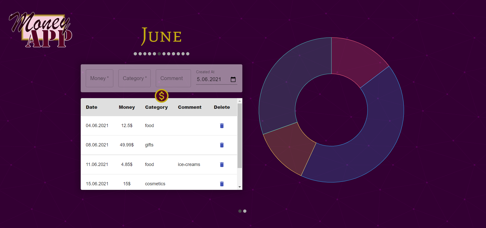
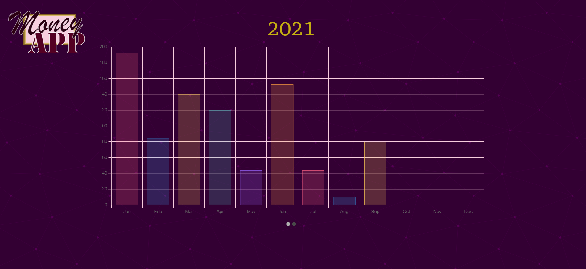

# Money App
App for tracking your spending.

## Table of Contents

- General Info
- Features
- Technologies
- Setup

## General Info

This project was created as a task for a college classes. This web application allows you to manage your monthly spending (add, delete). There is also a possibility to compare final sums per year.

## Features

To add new spend you have to fill the form you find on the home page. There are two required values - money, which is the amount of money you have spent, and a category that could summarise the spend. Additionally, you can add a comment and a date. If you do not change the date it will be the current day. 
To submit the form you have to click the button represented by the dollar sign below the form, or just click "enter".
To change the month you have to click the proper dot below the current month name.

To see the chart for year's statistics, you have to click the second of the dots sit at the very bottom of the site.

## Technologies

The project was created with:

- Node.js 14.16.1
- React 17.0.2
- Redux 4.1.0
- Chart.js 3.3.2
- Material-UI 4.11.4
- MongoDB Atlas
- Mongoose 5.12.10
- Express 4.17.1
- Nodemon 2.0.7
- Axios 0.21.1
- CSS
- HTML

## Setup

To run this application you have to download client and server directories.
Both of them you can run by typing:

### `npm start`

